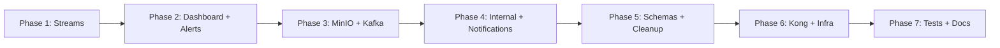

# Sarvanetra Backend — Complete Implementation Plan

> **Goal:** Fill all empty stubs, wire missing services, fix infrastructure gaps, and get the full backend test-ready so you can connect real cameras and validate every service end-to-end.

---

## Current State Audit

After thorough analysis of the codebase, here is the status of every component:

### ✅ COMPLETE — Implemented & Working

| Component | Key Files | Status |
|-----------|-----------|--------|
| **FastAPI Core** | `main.py`, `config.py`, `database.py`, `middleware.py` | Full app factory, lifespan, CORS, logging |
| **Auth System** | `security.py`, `auth_service.py`, `kong_service.py`, `user_service.py` | Login, refresh, JWT, Kong consumers, user CRUD |
| **Auth API** | `api/v1/auth.py`, `api/v1/users.py` | All endpoints wired |
| **Camera System** | `camera_service.py`, `mediamtx_service.py`, `api/v1/cameras.py` | CRUD + MediaMTX registration |
| **Customer System** | `customer_service.py`, `api/v1/customers.py`, `api/v1/geography.py` | Full CRUD with role filtering |
| **Devices** | `api/v1/devices.py` | Device registration |
| **Recordings** | `recording_service.py`, `api/v1/recordings.py` | Search + download |
| **Motion** | `api/v1/motion.py` | Motion event history |
| **Dashboard API** | `api/v1/dashboard.py` | Route defined, but service is empty |
| **Workers** | `base_consumer.py`, `motion_consumer.py`, `onvif_producer.py`, `status_consumer.py`, `upload_worker.py` | All Kafka workers implemented |
| **Database** | All models, `0001_initial_schema.py` | Full schema with `sv_` prefix + seed data |
| **Tests** | `test_security.py` (12 tests), `test_auth_api.py` (12 tests) | Auth module has good coverage |
| **Docker** | `docker-compose.yml`, all infra configs | Full dev stack operational |

### ❌ EMPTY — Must Be Implemented (22 files)

#### Services (5 files)
| File | Impact |
|------|--------|
| [dashboard_service.py](file:///opt/bsnl-surv-2/backend/app/services/dashboard_service.py) | **CRITICAL** — Dashboard stats returns nothing |
| [stream_service.py](file:///opt/bsnl-surv-2/backend/app/services/stream_service.py) | **CRITICAL** — Cannot generate HLS stream URLs |
| [kafka_service.py](file:///opt/bsnl-surv-2/backend/app/services/kafka_service.py) | **HIGH** — No async Kafka producer for backend-initiated events |
| [minio_service.py](file:///opt/bsnl-surv-2/backend/app/services/minio_service.py) | **HIGH** — No presigned URL generation for recordings |
| [notification_service.py](file:///opt/bsnl-surv-2/backend/app/services/notification_service.py) | MEDIUM — No push notifications |

#### API Routes (3 files)
| File | Impact |
|------|--------|
| [alerts.py](file:///opt/bsnl-surv-2/backend/app/api/v1/alerts.py) | **CRITICAL** — No camera alert endpoints |
| [streams.py](file:///opt/bsnl-surv-2/backend/app/api/v1/streams.py) | **CRITICAL** — No stream token/HLS URL endpoints |
| [internal.py](file:///opt/bsnl-surv-2/backend/app/api/v1/internal.py) | **HIGH** — No webhooks for MediaMTX/workers |

#### Schemas (3 files)
| File | Impact |
|------|--------|
| [alert.py](file:///opt/bsnl-surv-2/backend/app/schemas/alert.py) | Blocks alerts API |
| [device.py](file:///opt/bsnl-surv-2/backend/app/schemas/device.py) | Missing device request/response types |
| [motion.py](file:///opt/bsnl-surv-2/backend/app/schemas/motion.py) | Missing motion event response types |

#### Models (2 files)
| File | Impact |
|------|--------|
| [plan.py](file:///opt/bsnl-surv-2/backend/app/models/plan.py) | Empty — plan_master defined in customer.py, this is unused |
| [stream.py](file:///opt/bsnl-surv-2/backend/app/models/stream.py) | Empty — stream_master defined in device.py, this is unused |

#### Tests (5 files)
| File | Impact |
|------|--------|
| [test_auth.py](file:///opt/bsnl-surv-2/backend/tests/unit/test_auth.py) | No unit tests for auth service |
| [test_camera_service.py](file:///opt/bsnl-surv-2/backend/tests/unit/test_camera_service.py) | No camera service tests |
| [test_stream_service.py](file:///opt/bsnl-surv-2/backend/tests/unit/test_stream_service.py) | No stream service tests |
| [test_camera_api.py](file:///opt/bsnl-surv-2/backend/tests/integration/test_camera_api.py) | No camera API integration tests |
| [test_motion_flow.py](file:///opt/bsnl-surv-2/backend/tests/integration/test_motion_flow.py) | No motion flow integration tests |

#### Docs (4 files)
| File | Impact |
|------|--------|
| [architecture.md](file:///opt/bsnl-surv-2/docs/architecture.md) | Empty |
| [api.md](file:///opt/bsnl-surv-2/docs/api.md) | Empty |
| [decisions.md](file:///opt/bsnl-surv-2/docs/decisions.md) | Empty |
| [runbook.md](file:///opt/bsnl-surv-2/docs/runbook.md) | Empty |

### ⚠️ Router Registration Gap

[api/v1/__init__.py](file:///opt/bsnl-surv-2/backend/app/api/v1/__init__.py) is **missing** registrations for:
- `alerts_router` — not imported or included
- `streams_router` — not imported or included
- `internal_router` — not imported or included (should be at `/internal/` prefix, not `/api/v1/`)

### ⚠️ Kong Setup Issues

[setup-kong-jwt.sh](file:///opt/bsnl-surv-2/infra/kong/setup-kong-jwt.sh) still references:
- Legacy `djangocc:8000` service (lines 363-393) — **must be removed**
- Legacy `cctv-client` consumer with hardcoded key/secret — needs to coexist with per-user consumers

---

## Proposed Changes — 7 Phases

> [!IMPORTANT]
> **Phase order matters.** Each phase builds on the previous. Complete acceptance criteria before moving to the next phase.

---

### Phase 1 — Stream Service & HLS URL Generation (Camera Viewing)

> This is the #1 blocker for camera testing. Without this, no live video.

#### [NEW] [stream_service.py](file:///opt/bsnl-surv-2/backend/app/services/stream_service.py)
- `StreamService` class with:
  - `generate_stream_token(cam_id, user_id)` → returns `StreamTokenResponse` with JWT + HLS URL
  - `validate_stream_token(token)` → decodes and validates stream JWT
  - `get_hls_url(cam_id, token)` → builds full HLS URL for frontend player
- Uses `create_stream_token` / `decode_stream_token` from `security.py` (already implemented)
- HLS URL pattern: `http://{domain}/stream/hls/live/{cam_id}/index.m3u8?token={token}`

#### [NEW] [streams.py](file:///opt/bsnl-surv-2/backend/app/api/v1/streams.py)
- `GET /api/v1/cameras/{cam_id}/stream-token` — authenticated, returns stream token + HLS URL
- `GET /api/v1/streams/{cam_id}/hls-url` — returns full HLS URL for player
- Both require `get_current_user` dependency
- Verify camera exists and user has access to camera's company

#### [MODIFY] [__init__.py](file:///opt/bsnl-surv-2/backend/app/api/v1/__init__.py)
- Import and register `streams_router`

#### Acceptance Criteria
- [ ] `GET /api/v1/cameras/{cam_id}/stream-token` returns `{token, stream_url, expires_at}`
- [ ] Stream token contains `type: "stream"` and `cam_id` claims
- [ ] `POST /api/v1/auth/validate-stream-token?token=X` returns 200 for valid stream tokens
- [ ] Invalid/expired stream tokens return 401

---

### Phase 2 — Dashboard Service & Alerts System

#### [NEW] [dashboard_service.py](file:///opt/bsnl-surv-2/backend/app/services/dashboard_service.py)
- `DashboardService` class with:
  - `get_stats(user)` → role-filtered stats: total cameras, online/offline counts, active motion events, recording count, customer count
  - `get_camera_status(user)` → per-camera online/offline from MediaMTX active paths + `sv_camera_health`
- Queries `sv_camera_master`, `sv_camera_health`, `sv_motion_event`, `sv_video_segment`
- Calls `MediaMTXService.get_active_paths()` for live status
- Uses Redis to cache stats for 30 seconds to avoid repeated heavy queries

#### [NEW] [alert.py](file:///opt/bsnl-surv-2/backend/app/schemas/alert.py)
- `CameraAlertResponse` — id, camera_id, cam_name, status, timestamp, duration, acknowledged
- `AlertAcknowledgeRequest` — alert_id
- `AlertListResponse` — paginated list of alerts
- `CameraHealthResponse` — current_status, last_change, last_downtime_duration

#### [NEW] [alerts.py](file:///opt/bsnl-surv-2/backend/app/api/v1/alerts.py)
- `GET /api/v1/alerts` — role-filtered camera status alerts from `sv_camera_status_log`
- `PATCH /api/v1/alerts/{id}/acknowledge` — mark alert as acknowledged
- `GET /api/v1/cameras/{cam_id}/health` — camera health from `sv_camera_health`
- Requires `get_current_user`; sysadmin sees all, others filtered by scope

#### [MODIFY] [__init__.py](file:///opt/bsnl-surv-2/backend/app/api/v1/__init__.py)
- Import and register `alerts_router`

#### Acceptance Criteria
- [ ] `GET /api/v1/dashboard/stats` returns counts matching database state
- [ ] `GET /api/v1/dashboard/camera-status` returns live online/offline per camera
- [ ] `GET /api/v1/alerts` returns paginated alert list
- [ ] `PATCH /api/v1/alerts/{id}/acknowledge` updates the alert
- [ ] Stats are cached in Redis (30s TTL)

---

### Phase 3 — MinIO Service & Kafka Producer

#### [NEW] [minio_service.py](file:///opt/bsnl-surv-2/backend/app/services/minio_service.py)
- `MinIOService` class using the `minio` Python client:
  - `generate_presigned_url(bucket, object_name, expires)` → presigned download URL
  - `upload_file(bucket, object_name, file_path)` → upload to MinIO
  - `list_objects(bucket, prefix)` → list recordings for a camera
  - `delete_object(bucket, object_name)` → cleanup
  - `ensure_bucket(bucket)` → create bucket if not exists
- Uses `app/core/minio.py` (already has client setup)

#### [NEW] [kafka_service.py](file:///opt/bsnl-surv-2/backend/app/services/kafka_service.py)
- `KafkaProducerService` singleton:
  - `start()` / `stop()` — lifecycle managed by app lifespan
  - `publish(topic, event: KafkaEvent)` — send event to Kafka topic
  - `publish_camera_status(cam_id, status)` — publish to `camera.status`
  - `publish_motion_event(cam_id, is_motion)` — publish to `camera.motion`
  - `publish_recording_segment(cam_id, file_path)` — publish to `recording.segments`
- Uses `aiokafka.AIOKafkaProducer`
- `KafkaEvent` Pydantic model with `event_id`, `event_type`, `timestamp`, `payload`

#### [MODIFY] [main.py](file:///opt/bsnl-surv-2/backend/app/main.py)
- Start Kafka producer in lifespan `startup`
- Stop Kafka producer in lifespan `shutdown`

#### Acceptance Criteria
- [ ] `MinIOService.generate_presigned_url()` returns a valid download URL
- [ ] `KafkaProducerService.publish()` sends events to Kafka topics
- [ ] Kafka producer starts/stops cleanly with the app lifecycle
- [ ] Recording download endpoint uses presigned URLs instead of direct file paths

---

### Phase 4 — Internal Endpoints & Notification Service

#### [NEW] [internal.py](file:///opt/bsnl-surv-2/backend/app/api/v1/internal.py)
- These endpoints are called by MediaMTX, Nginx, and Kafka workers — **no JWT auth**, protected by Nginx blocking external access:
  - `POST /internal/stream-event` — MediaMTX reports stream ready/not-ready → publishes to `camera.status` Kafka topic
  - `POST /internal/recording-complete` — MediaMTX reports new segment → publishes to `recording.segments` Kafka topic
  - `POST /internal/stream-health` — MediaMTX periodic health → updates `sv_camera_health`
  - `POST /internal/camera-alerts` — Workers report camera offline → creates `sv_camera_status_log` entry + triggers notification
  - `POST /internal/fcm-message` — Queue an FCM push notification
  - `POST /internal/device-heartbeat` — Edge device heartbeat → updates `sv_device_master.mqtt_update`

#### [NEW] [notification_service.py](file:///opt/bsnl-surv-2/backend/app/services/notification_service.py)
- `NotificationService` class:
  - `send_camera_offline_alert(cam_id, cam_name, customer_id)` — send FCM to all users of that customer
  - `send_motion_alert(cam_id, cam_name, customer_id)` — optional motion notifications
  - `_send_fcm(device_tokens, title, body, data)` — HTTP call to Firebase Cloud Messaging API
- Reads `fcm_server_key` from settings; gracefully no-ops if not configured

#### [MODIFY] [main.py](file:///opt/bsnl-surv-2/backend/app/main.py)
- Mount `internal_router` at `/internal/` prefix (separate from `/api/v1/`)

#### [MODIFY] [__init__.py](file:///opt/bsnl-surv-2/backend/app/api/v1/__init__.py)
- The internal router should NOT be under `/api/v1/` — it mounts directly on the app

#### Acceptance Criteria
- [ ] `POST /internal/stream-event` processes MediaMTX events
- [ ] `POST /internal/recording-complete` triggers recording segment processing
- [ ] `POST /internal/camera-alerts` creates status log entries
- [ ] FCM notifications sent when `fcm_server_key` is configured
- [ ] Internal endpoints are not accessible via Kong (only internal Docker network)

---

### Phase 5 — Missing Schemas & Model Cleanup

#### [NEW] [device.py](file:///opt/bsnl-surv-2/backend/app/schemas/device.py)
- `DeviceCreateRequest` — device_id, username, password, dev_name, dev_loc
- `DeviceUpdateRequest` — staging_status, status_log, mqtt_status
- `DeviceResponse` — all fields with `from_attributes=True`
- `DeviceListResponse` — paginated

#### [NEW] [motion.py](file:///opt/bsnl-surv-2/backend/app/schemas/motion.py)
- `MotionEventResponse` — id, camera_id, cam_name, motion_start, motion_end, is_active, duration_seconds (computed)
- `MotionEventListResponse` — paginated
- `MotionHealthResponse` — status, status_start, status_end, failure_reason

#### [DELETE] [plan.py](file:///opt/bsnl-surv-2/backend/app/models/plan.py)
- Empty file — `plan_master` is already defined in [customer.py](file:///opt/bsnl-surv-2/backend/app/models/customer.py)

#### [DELETE] [stream.py](file:///opt/bsnl-surv-2/backend/app/models/stream.py)
- Empty file — `stream_master` is already defined in [device.py](file:///opt/bsnl-surv-2/backend/app/models/device.py)

#### Acceptance Criteria
- [ ] All API endpoints use typed Pydantic schemas — no raw dict returns
- [ ] Empty model stub files removed
- [ ] `ruff check .` passes

---

### Phase 6 — Kong Cleanup & Infrastructure Fixes

#### [MODIFY] [setup-kong-jwt.sh](file:///opt/bsnl-surv-2/infra/kong/setup-kong-jwt.sh)
- **Remove** the Django file auth service block (lines 362-393) — Django is gone
- **Keep** the legacy `cctv-client` consumer for backward compatibility
- **Add** a FastAPI API service + route for `/api/` traffic with JWT plugin:
  ```bash
  # FastAPI API Service
  curl -s -X POST "$KONG_ADMIN_URL/services/" \
    --data "name=fastapi-api" \
    --data "url=http://sarvanetra_api:8000"

  # API Route with JWT
  curl -s -X POST "$KONG_ADMIN_URL/services/fastapi-api/routes" \
    --data "name=fastapi-api-route" \
    --data "paths[]=/api" \
    --data "strip_path=false"
  ```
- Add JWT plugin to the FastAPI route

#### [MODIFY] [.env](file:///opt/bsnl-surv-2/backend/.env)
- Change `KONG_ADMIN_URL` from `http://localhost:8001` to `http://kong:8001` (must use Docker hostname)

#### [MODIFY] [docker-compose.yml](file:///opt/bsnl-surv-2/docker-compose.yml)
- Add `KONG_ADMIN_URL` to fastapi service environment
- Ensure `kong-config` runs after `fastapi` is healthy (for FastAPI service registration)

#### Acceptance Criteria
- [ ] Kong no longer references Django
- [ ] FastAPI API routes go through Kong JWT validation
- [ ] `KONG_ADMIN_URL` uses Docker network hostname
- [ ] `docker compose up` → all services healthy

---

### Phase 7 — Tests & Documentation

#### [NEW] [test_camera_service.py](file:///opt/bsnl-surv-2/backend/tests/unit/test_camera_service.py)
- Test cam_id generation, duplicate stream detection, MediaMTX registration calls
- Mock `AsyncSession` and `MediaMTXService`

#### [NEW] [test_stream_service.py](file:///opt/bsnl-surv-2/backend/tests/unit/test_stream_service.py)
- Test stream token generation, HLS URL construction, token validation

#### [NEW] [test_camera_api.py](file:///opt/bsnl-surv-2/backend/tests/integration/test_camera_api.py)
- Test camera CRUD endpoints with role-based access
- Test stream token endpoint
- Test camera health endpoint

#### [NEW] [test_motion_flow.py](file:///opt/bsnl-surv-2/backend/tests/integration/test_motion_flow.py)
- Test motion event list with date filters
- Test motion event detail

#### [DELETE] [test_auth.py](file:///opt/bsnl-surv-2/backend/tests/unit/test_auth.py)
- Empty — auth unit tests are covered by `test_security.py`

#### [MODIFY] [architecture.md](file:///opt/bsnl-surv-2/docs/architecture.md)
- System architecture diagram, service dependency graph, data flow

#### [MODIFY] [api.md](file:///opt/bsnl-surv-2/docs/api.md)
- Full API endpoint reference generated from OpenAPI

#### [MODIFY] [runbook.md](file:///opt/bsnl-surv-2/docs/runbook.md)
- Deployment steps, troubleshooting, logs

#### Acceptance Criteria
- [ ] `uv run pytest` — all tests pass
- [ ] `uv run ruff check .` — no lint errors
- [ ] `uv run mypy app` — type checks pass
- [ ] Documentation covers architecture, API, and operations

---

## Open Questions

> [!IMPORTANT]
> **Camera connectivity:** What are the RTSP stream URLs and credentials for the cameras you want to test with? I'll need this to:
> 1. Verify MediaMTX can pull RTSP feeds
> 2. Create test camera records in the database
> 3. Validate HLS streaming end-to-end

> [!IMPORTANT]
> **Kong admin access:** The `.env` has `KONG_ADMIN_URL=http://localhost:8001` but the Kong container uses Docker hostname `kong:8001`. Should Kong admin API also be exposed to the host for debugging (`ports: ["8001:8001"]`)?

> [!IMPORTANT]
> **FCM notifications:** Do you have a Firebase project + server key for push notifications, or should the notification service be a no-op stub for now?

---

## Verification Plan

### Automated Tests
```bash
cd /opt/bsnl-surv-2/backend && uv run pytest -v
cd /opt/bsnl-surv-2/backend && uv run ruff check .
cd /opt/bsnl-surv-2/backend && uv run mypy app
```

### Manual End-to-End Test (Camera → HLS → Frontend)
1. Start all services: `docker compose up -d`
2. Run migrations: `docker compose exec fastapi alembic upgrade head`
3. Login as admin: `POST /api/v1/auth/login` → get token
4. Create a camera: `POST /api/v1/cameras` with real RTSP URL
5. Verify MediaMTX registers: `GET http://mediamtx:9997/v3/paths/list`
6. Get stream token: `GET /api/v1/cameras/{cam_id}/stream-token`
7. Open HLS URL in browser/VLC → verify live video
8. Check dashboard: `GET /api/v1/dashboard/stats` → camera shows online
9. Check recordings (after 20s): `GET /api/v1/recordings?cam_id=X`
10. Check motion events: enable ONVIF workers, verify motion events appear

### Phase Execution Order


> **Estimated effort:** Phases 1-4 are the core work (~70% of effort). Phases 5-7 are polish and hardening.
